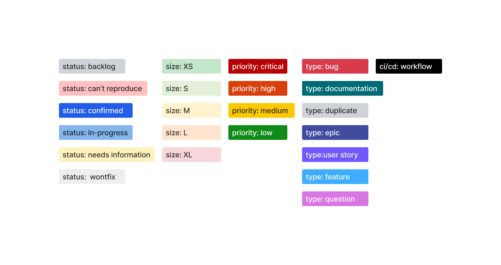

# 🚀 TypeScript Workflow Template

Welcome to the **TypeScript Workflow Template** repository! This repository comes pre-configured with a modern, high-performance tooling ecosystem designed to automate code quality, dependency management, commit standards, and seamless continuous integration.

## 🛠️ Built-In Tooling & Plugins

This template integrates a suite of automated workflows and git hooks categorized by their function:

### Code Quality & Formatting

- **[Ultracite](https://www.ultracite.ai/docs)**: Orchestrates ultra-fast linting and formatting powered internally by [**oxlint**](https://oxc.rs/docs/guide/usage/linter.html) and [**oxfmt**](https://oxc.rs/docs/guide/usage/formatter.html).
- **[Autofix](https://autofix.ci/setup)**: Automatically fixes linting and formatting issues directly on your Pull Requests.

### Commit & Git Workflow

- **[Lefthook](https://lefthook.dev/)**: A lightning-fast Git hooks manager that runs linters and commit checks locally before pushing.
- **[Commitlint](https://commitlint.js.org/guides/getting-started.html)**: Enforces the [**Conventional Commits specification**](https://www.conventionalcommits.org/en/v1.0.0/) on your commit messages.
- **[Commitizen](https://github.com/commitizen/cz-cli)**: Provides a command-line wizard to help you write formatted commit messages.

### Project & Automation

<!-- Add a configs folder for easier management -->

- **[Semantic Release](https://semantic-release.org/intro/)**: Fully automates the package release workflow, determining version numbers and generating changelogs based on commit history.
- **[Renovate](https://docs.renovatebot.com/getting-started/installing-onboarding/)**: Keeps your `npm` packages and GitHub Actions automatically updated via automated PRs.

### Issue & Label Management

- **[Label Sync](https://github.com/marketplace/actions/label-sync)**: Ensures standard issue labels are identical across your repositories.
- **[Advanced Issue Labeler](https://github.com/marketplace/actions/advanced-issue-labeler)**: Dynamically assigns labels to new issues based on body content or template selection.
- [**Issue Forms**](https://docs.github.com/en/communities/using-templates-to-encourage-useful-issues-and-pull-requests/configuring-issue-templates-for-your-repository#creating-issue-forms): Pre-configured issue forms for streamlined [**Bug Reports**](.github/ISSUE_TEMPLATE/bug_report.yml) and [**Feature Requests**](.github/ISSUE_TEMPLATE/feature_request.yml).

### Security & CI/CD

- **[CodeQL](https://docs.github.com/en/code-security/concepts/code-scanning/codeql/codeql-code-scanning)**: Industry-grade static analysis engine by GitHub to discover vulnerabilities in your codebase.
- [**Node.js Build And Test Pipeline**](.github/workflows/node.js.yml): Automatically validates type safety, runs unit tests, and verifies production builds on every PR.

## 🚀 Getting Started

### 1. Generate Your Repository

Click the green **"Use this template"** button at the top right of this repository page or click **[Direct Template Link](https://github.com/JohanTran02/workflow-template-ts/generate)** to instantly create a new repository in your own account.

### 2. Setup Repository

- **Install Github Apps**
  - Grant these apps permission to your newly generated repository.
    - [**Renovate**](https://github.com/apps/renovate)
    - [**Autofix**](https://github.com/marketplace/autofix-ci#pricing-and-setup)
- **Sync Repository Labels:**
  1. Navigate to your new repository on GitHub and click on the **Actions** tab.
  2. Select **Sync Labels** from the left sidebar.
  3. Click the **Run workflow** dropdown menu on the right and trigger it manually.

**Labels** 

- **Notes:**
  - **Advanced Issue Labeler** auto-applies `size` and `priority` labels selected in [Bug Reports](.github/ISSUE_TEMPLATE/bug_report.yml) and [Feature Requests](.github/ISSUE_TEMPLATE/feature_request.yml) (configured [here](.github/advanced-issue-labeler.yml)).
  - [**Label Schema**](.vscode/labels-schema.json) used for autocompletion in **VS Code** when modifying labels in Issue forms.

### 3. Local Setup

Run the following commands in your terminal to clone your newly generated repository and install the dependencies _(this will automatically initialize your Git hooks)_:

```bash
# 1. Clone your new repo (Make sure to replace this with YOUR actual URL!)
git clone https://github.com

# 2. Move into the project directory
cd YOUR-NEW-REPOSITORY

# 3. Install dependencies and initialize git hooks
npm install
```

## ⚓ [Git Hooks](https://git-scm.com/book/ms/v2/Customizing-Git-Git-Hooks) (Lefthook Ecosystem)

This template uses **Lefthook** to automate checks locally before code ever leaves your machine. The following hooks are [**pre-configured**](lefthook.yml):

- **`prepare-commit-msg`:** Intercepts standard `git commit` commands to automatically launch the **Commitizen** in your terminal.
- **`commit-msg`:** Runs **Commitlint** against your commit message to guarantee it follows the Conventional Commits specification.
- **`pre-commit`:** Runs `ultracite fix` on your staged files to handle formatting, linting, and type-aware diagnostics. Any automatically fixed files are re-staged before the commit completes.

## 📋 Available Scripts

- `npm run fix` — Run both `oxlint` and `oxfmt` with Ultracite to auto-fix errors and format code.
- `npm run check` — Audit format and lint rules across all files without modifying them.
- `npm run prepare` — Syncs Lefthook hooks automatically on `npm install`.
- `npm run build` — Compile the project for production. _(Referenced by [**CodeQL Workflow**](.github/ISSUE_TEMPLATE/codeql.yml))_
- `npm test` — Run the local test suite. _(Referenced by [**CodeQL Workflow**](.github/ISSUE_TEMPLATE/codeql.yml))_

**Note**: Define test and build commands in `package.json`. The CI pipeline runs these automatically if they are present, so you don't need to modify the workflow files.

## 📁 Repository Structure

```text
│   .gitignore
│   .releaserc
│   commitlint.config.ts
│   lefthook.yml
│   oxfmt.config.ts
│   oxlint.config.ts
│   package-lock.json
│   package.json
│   README.md
│   renovate.json
│   tsconfig.json
│
├───.github
│   │   advanced-issue-labeler.yml
│   │   labels.yml
│   │
│   ├───ISSUE_TEMPLATE
│   │       bug_report.yml
│   │       config.yml
│   │       feature_request.yml
│   │
│   └───workflows
│           autofix.yml
│           codeql.yml
│           issue-labeler.yml
│           label-sync.yml
│           node.js.yml
│           release.yml
│
└───.vscode
        extensions.json
        labels-schema.json
        settings.json
```